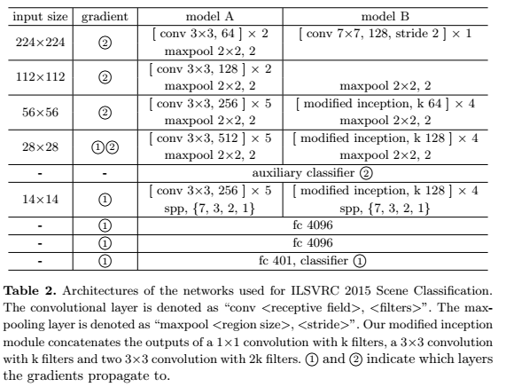
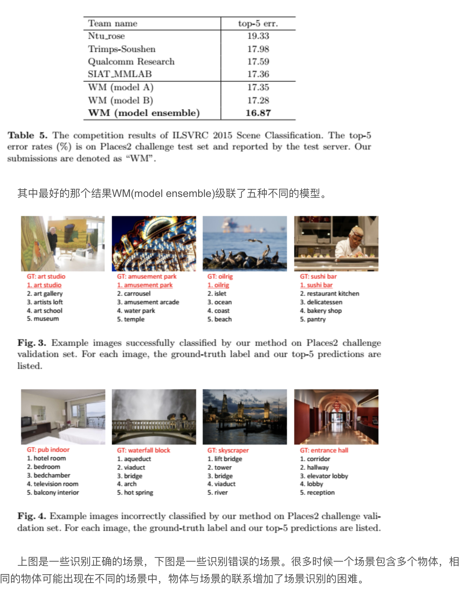

## who

* 2016

* [paper](paper/01.292-16-Relay-Backpropagation-for-Effective-Learning-of-Deep-Convolutional-Neural-Networks.pdf)

* [[论文笔记]Relay Backpropagation for Effective Learning of Deep Convolutional Neural Networks](https://blog.csdn.net/talysun0715/article/details/79446372)

## what

* 提出了一种新的方法，Relay Backpropagation,使得有效信息可以在训练阶段被传播，此方法获得了ILSVRC 2015 Scene Classification 挑战的第一名。

## where

### 动机

* 随着近年来卷积神经网络CNN的应用，在许多计算机视觉任务中获得了巨大的突破；与此同时，网络深度的重要性也被揭露出来了，比如VGG16比AlexNet有更深的网络，在ImageNet数据集上也有更好的精度。

* 增加网络深度变成了一种有效提升系统性能的方法，但是随之也增加了参数量和模型复杂度，因此优化这些网络难度是巨大的。训练这种网络容易发散，收敛很慢或过拟合。并且通过实验发现，提升精度不能只是简单的增加网络深度。根据实验结果，增加深度不能很好地达到预期效果。

* 为了解释这种现象，需要探索梯度的消失或爆发，梯度有可能在很深的网络中变得很大或很小。通过观察各层的绝对梯度和相对梯度（相对于权重来说），可以发现在较低层的梯度并未消失并且稳定持续的优化网络，但是梯度消失或爆发往往伴随着加入了一些网络，比如rectifier neuron, refined initialiaztion scheme和Batch Normalization。

* 然而，从信息论的角度来说，随着传播的层数增加，目标的信息量在减少。在标准的传播过程中，错误的信息是不可避免的被传播的。

* 因此，提出了Relay Backpropagation(Relay BP),这使得在训练中只传递有效信息。具体的方法是，首先将整个网络分成几个模块，然后引入一种或多种暂时的输出模型（包括loss层），来一起优化级联的loss函数。更重要的是每一个loss只能传递到规定的最低的N层，比如说一个网络有19层，N=5,那么每个loss只能传递到从loss自己这层开始算起的第5层。

* 也就是说，这篇论文提供了一个方法保护相关的信息不要因为传递太多层而丢失太多，并且限制不利的相关信息不要传递太多层，产生逐渐放大的恶劣效果。
* 之后，会将这个方法在不同的数据集上和网络上训练验证，证明这个方法不光只能用在特定的网络和数据集上。

## where

### 1 相关工作

卷积神经网络，近年来有复杂度和深度增加的趋势，一系列的方法被提出，来解决这个问题：

​	1. 预训练。

​	2.使得网络初始化参数符合特定的分布。

​	3.新的激活函数。

​	4.更好的优化器。

  同时有人也提出了用多条路径去训练网络，但是他们忽略了不利的信息不应该传递到太低的层。除此之外，新的网络结构也被提出，比如Inception module和Residual Block。但是梯度爆炸和消失问题依然存在

### 2 标准的后向传播和信息减少

* 在训练神经网络的后向过程中，错误的信息会随着传递的层数增加而增加。
* 从信息论的角度来考虑，从最高层(loss层)传递到最低层(第一层)的梯度传递过程，实际上是一个马尔科夫链的信息流。也就是梯度暗含了信息在里面。让y表示loss层，x表示loss的前一层，u表示loss的前二层，那么信息传递的方式是y->x->u，而他们的互信息总是I(y;x)>=I(y,u)，这就意味着随着后向传播的进行，每一层必然会丢失一定信息(丢失loss层的信息)，因此标准的后向传播算法不允许网络的层数太深。

## how

### Relay BackPropagation

* 这篇论文的动机就是要通过后向传播传递有效信息。于是，使用了辅助输出模块。拿VGG-19举例，将神经网络分成五个部分,conv1->maxpool3;conv4->maxpool6...总之就是把卷积层遇到的第一个池化层算作一个部分。然后根据每个部分附上辅助的输出模块(参考上图),为了保存相关信息，每个辅助模块只能往后传播N个层，N是人为设置的(我们认为传播多余N层就不能再传递有效信息)。

* 更重要的是，信息传递的路径是有彼此覆盖到的，比如这里：

绿色路径和蓝色路径就都有覆盖到，这么做得目的是融合蓝色和绿色的信息流，使得我们可以优化三个loss.

    总之，这个新的方法有两个特点:
    
        (1)不同的loss负责不同的模块，这种办法有利于减少相关信息的恶化，和限制不利信息在长途的后向传播过程中被传递。
    
        (2)信息流在中间层会有重合部分，这是为了调和在后向传播中的不同信息流。
    
      在前向传播过程中，输入图片，然后信息会传递到每一个模块(参见上图中间部分)。在测试图片，则不再使用辅助模块。

      在使用这个算法的时候，要考虑以下几个问题:(1)要把辅助模块加在哪里?(2)哪些模块应该属于哪些特定的loss函数?这个要基于经验或是启发式方法去调整，但是有一个直观的问题，就是不要在前两个部分加入辅助模块，因为一方面是他们的层数不够深，不需要这种模块；一方面也是因为前两部分的层数不够，所以不能产生足够的能够有判别力的信息。
## how much

在实验阶段，用Places和ImageNet数据集和用不同的四种网络集评估Relay BP算法，我们会显示Relay BP会超越以下两种方法:

        (1)标准的后向传播
    
        (2)多路径的损失函数+标准的后向传播
    
      除此之外，为了公平比较，网络结构都是相同的，不同之处在于训练阶段后向传播的信息流动方式。试验阶段，只加入一个辅助模块，因为如果加入多个分叉会增加计算成本。
### 1 Places2 挑战

Places数据集有401类，8.1百万的图片，2万验证集，38.1万的测试集。为了模仿真实世界，数据集每一类的分布都是不均匀的，从4000到30000。采用Top-5 错误率来评估。

​      网络结构:

 说明：model A是基于VGG-19修改后的网络，在特征图输出为(56,28,14)后简单的加入一共三层的卷积层，变成VGG-22。model B是修改后的inception网络。

### 2 Class-aware Sampling:

* 由于数据不是均匀分布的，我们在训练阶段采用了一种采样策略，叫做"class-aware sampling"。主要想法就是尽可能的保证在每一个批次中,每一个类出现的概率都是一样的；并且避免图片输入都是一样的顺序。在实验阶段，我们使用两种列表，第一种表是类列表，第二种表有401个，每个表都装了这个类所有的图片。设置一个mini-batch，每一次训练都会选取一些类让这些类的每一个类的图片数量都满足mini-batch，按照列表顺序选取，列表选完了就重新洗牌。也就是说，比如在第一种类列表选了X,N,Y类，然后mini-batch是30，那就到X,N,Y类对应的图片类表选取相应10张图片(个人的理解，不知道是否理解错误)，当第二种列表选完了，就重新打乱。当整个类轮过一次了就重新打乱。这种操作会提升0.6%的精度。

### 3 Traning and Testing

在训练阶段,除了用Places数据集之外，不用其他的数据集。每张图片都调整到256X256，然后在用224x224对图片进行随机采样,用减均值操作。同时用了随机水平翻转和标准的颜色偏移。用随机梯度下降法(SGD)训练网络，mini-batch size是256，momentum 0.9。学习率设置0.01,当错误率不再变化就衰减10分之1。权重正则化0.0002。每个模型训练80X10^4次。

      在测试阶段，对图片采用中心提取"single crop"的方式截取测试集图片的中间部分，同时也用全卷积的方式测试模型的single model性能。
    
      结果比较：

 尽管muti-loss+standard BP效果是不错的，但是微乎其微。但是Relay BP的效果就比较明显。值得注意的是muti-loss对于model B的提升微乎其微，这是因为model B的shortcut 已经把有关信息传递下去了，但是用Relay BP 效果就很明显，这是因为Relay BP还有阻止无关信息传递的作用而Muti-loss的方法并没有。

      对于Table 4提升效果是较不明显的，但是在ImageNet数据集提升的比较明显。

### 4. ILSVRC 2015 挑战结果：

