* 优化和正则太难了，第一次迭代以失败告终，能量密度在下降，不能再耗损，只是有了一定的了解。


# Regularization 

## what

* 防止过拟合
* 减少泛化误差，而不是训练误差；


## how
* [code](02.正则化，优化/Regularization.html)

### 1. 参数范数惩罚


* 正则项变大，然后w就会变小，激活函数如果是sigmoid就是趋向于中间，那么是个线性神经元，你的网络将只能学习到线性函数。
* 参数范数 Ω 的不同选择会导致不同的优先解。
* 我们只约束w，因为w表示两个变量的相互作用关系，而每个偏置仅控制一个单变量。

#### 1.1 L2正则化

* 这里学习率更新的部分没变， 每次更新前对权值进行了衰减。
* l2约束

* 约束之后的目标函数

* 约束对每个权值的影响


* 对于目标函数不明感的轴会随着训练慢慢衰减掉。
* 线性回归中L2正则化

* L2 正则化不会导致参数变得稀疏。


#### 1.2 L1参数正则化

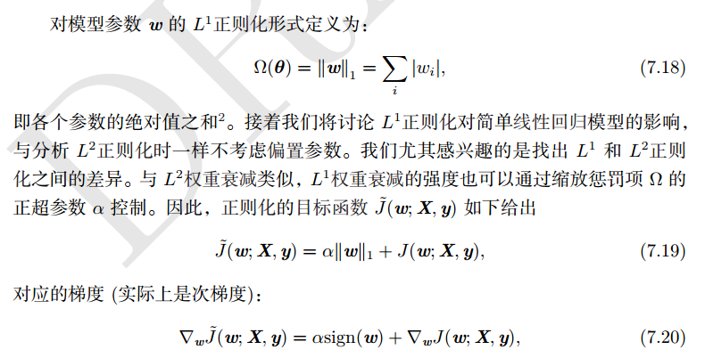
* L1 正则的过程

* 相比 L2正则化， L1正则化会产生更稀疏的解。此处稀疏性指的是一些参数具有 0 的最优值。
 L1正则化的稀疏性是相比 L2正则化是质的不同。


### 2. 作为约束的范数惩罚

* 我们可以把参数惩罚看作对权重强加的约束。如果Ω是L2范数，那么权重就是被约束在一个L2球中，
如果Ω是L1范数，那么权重就是被约束在一个L1范数限制的区域中。
* 使用显式约束和重投影的优点
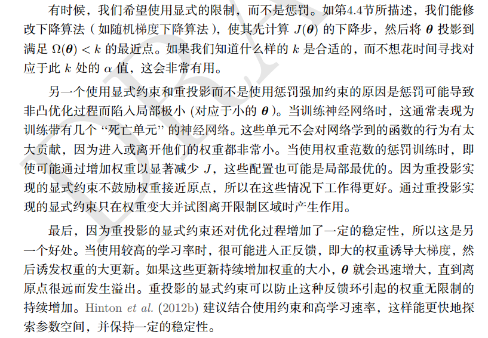


### 3 正则化和欠约束问题

* 正则化的必要性


### 4. 数据增强

* 加入噪声数据
* 合理变换数据

### 5. 噪声鲁棒性

* 对于某些模型，在模型的输入加上方差极小的噪声等价于对权重施加范数惩罚。 
* 在一般情况下，噪声注入远比简单收缩参数强大，特别是噪声添加到隐藏单元时更加强大。

### 8 提前终止

* 验证是记录最小的误差下的权值
* 提前终止算法

* 提前终止的策略

* 第一种策略，再次初始化模型，然后所有数据训练，使用第一轮训练的最佳步数

* 第二种策略：第二次训练使用全部数据和第一轮得到的参数。然后监控验证集上的损失函数，作为停止条件


* 提前终止如果充当正则化


### 9 参数绑定和参数共享

* 我们之前讨论约束和惩罚时，都是相当于固定的区域和点，L2正则化固定对参数偏离零的固定值进行惩罚。

* 目前最流行的和广泛使用的参数共享出现在计算机视觉领域，cnn


### 10 稀疏表示

* 权重衰减施加直接作用于模型参数的惩罚，另一种策略是将惩罚放在神经网络的激活单元，估计对应的激活的稀疏。
* 表示的稀疏和参数的稀疏不一样


### 11. bagging和其他集成方法

* bagging：集合几个模型，
* 模型平均奏效的原因是不同的模型通常不会再测试机上产生完全相同的错误。


### 12 dropout

* dropout的目标是在指数级数量的神经玩过上近似这个过程；
* dropout训练与bagging训练不太一样，在bagging的情况下，所有模型是独立的，dropout情况下，模型是共享参数的，
其中每个模型继承的父神经网络参数的不同子集。
* 参数共享使得在有限可用的内存下代表指数数量的模型变得可能。


* bagging集成必须从所有成员的累积投票做一个预测。我们将这个过程称为推断。
* dropout的方式不能依赖于任何的特征，因为任何特征都有可能被丢弃，
* dropOut是用来防止过拟合，所以除非你的网络过拟合， 负责不要使用。


## optimization

> what + how + why

> 下面回答 what
---
* 寻找神经网络中的一组参数，它能显著降低代价函数，该代价函数包含整个训练集的评估和额外的正则项。
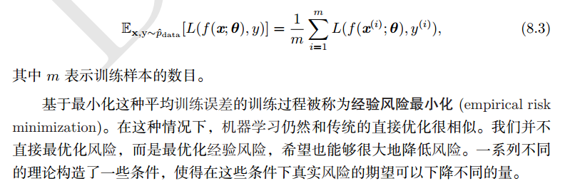
* 梯度下降是一种优化技术，决定参数需要优化的值，来增加模型的表现最小化损失函数。
* 找到目标函数的最优解

### 基于梯度的优化

* 导数内涵：提供当目标函数需要变化时，应该往哪个方向
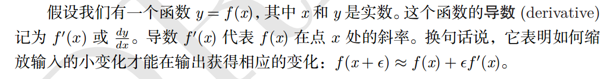


#### 1. 梯度之上： Jacobian和Hessian矩阵

* 我们遇到的Hessian矩阵几乎都是对称的，因为Hessian矩阵是实对称的，我们可以将其分解成一组实特征值和特征向量的正交。
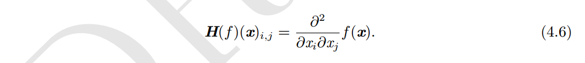

> 下面算法都是why的问题
----

### 批算法和minibatch算法

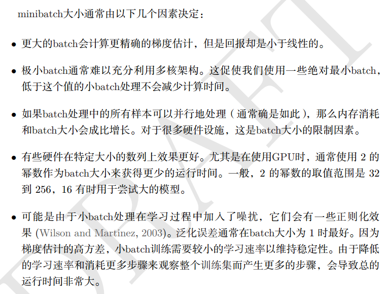
* 在数据集上的一次迭代叫做一个epoch， 在每个minibatch上迭代一次，叫做一步。

* 每一批选择n的大小不能太大
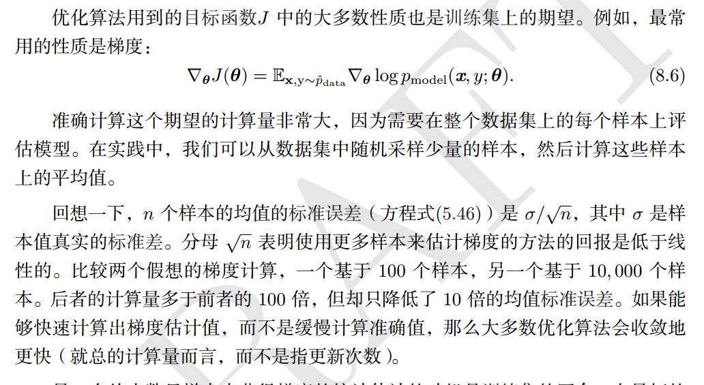

### 2. 神经网络优化中的挑战    

#### 2.1 病态

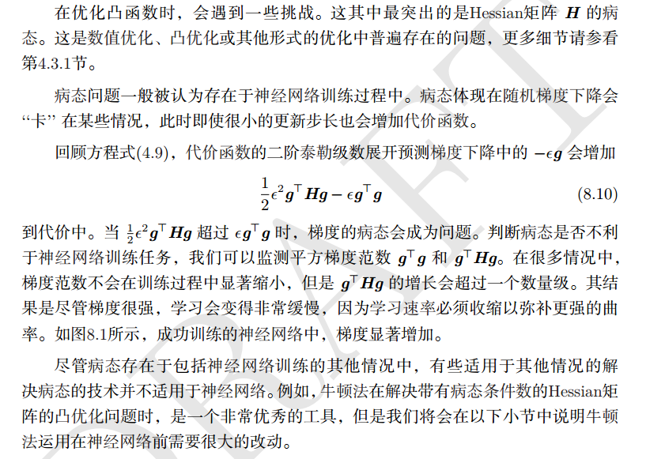

#### 2.2 局部极小值

* 凸优化问题的一个典型特点是其可规约成一个寻找局部极小值问题。


* 学者们现在猜想，对于足够大的神经网络来说，大部分局部极小值都具有很小的代价函数，我们能不能找到全局最小值，变得不是那么
重要了。

#### 2.3 鞍点和其他平坦区域

* 多数随机函数表现出，低维中局部极小值很常见，鞍点不常见，高维中，局部极小值很少见，但鞍点常见。

#### 2.4 梯度消失和爆炸

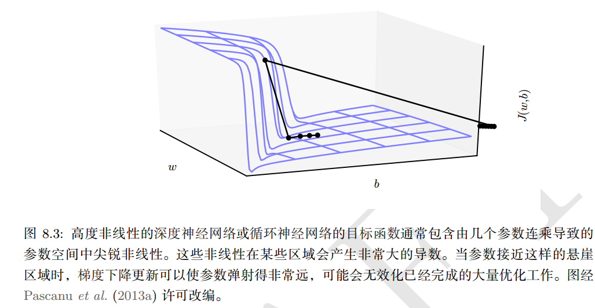

#### 2.5 长期依赖

* 因为长期依赖导致的梯度连乘中变得过大或者过小

* 这里的问题主要出现在循环神经网络中。

#### 2.6 非精确梯度

#### 2.7 局部和全局结构间的弱对应

* 当初始值初始不好时，优化只能趋向于一个局部小值，因为梯度下降只是让函数值变小。
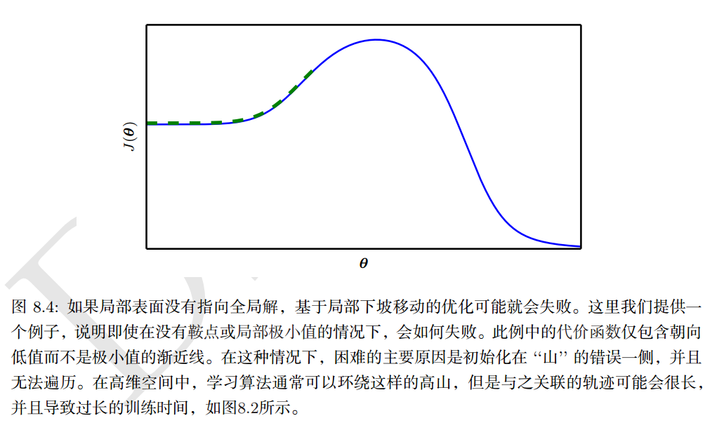

#### 2.8 优化的理论限制

* 有些问题只能是一个优化过程，不能定义是不是可解


> 下面算法都是how的问题
---
### 3. 基本算法           

#### 随机梯度下降

* 每次随机变换一个步伐
* 梯度指示方向信息，学习率指示改变的步长，更新的是参数，目的是当输入一定的时候，损失函数变小。


#### 3.2 动量

1. exponential weight average
    * 权值平均技术
    * v{t} = β*（v{t - 1}） + (1 - β)x
    * x表示实际每天的值，v{t}表示一个每天值的近似，这样处理之后每天的值就是一条曲线。
    * 当β很大时，收到前面值的影响也比较大，比如，前面50天的都有影响，直线越平滑
    * 当β很小时，表示受到前面的值影响越小，也就是越趋向于实时值，曲线抖动越明显。

* 指数平滑具体计算方法：对应值和对应参数乘，就得到了v100,这里的受前面天影响情况，按指数衰减


2. 偏差修正
* 指数平均中，开始的时候起点太低了，为了平均开始的这些值，使用偏差修正，也就是在每个v{t} / (1-β^{t})
* 开始的时候分母小，然后偏差修正，后面的时候分母为1，不影响。
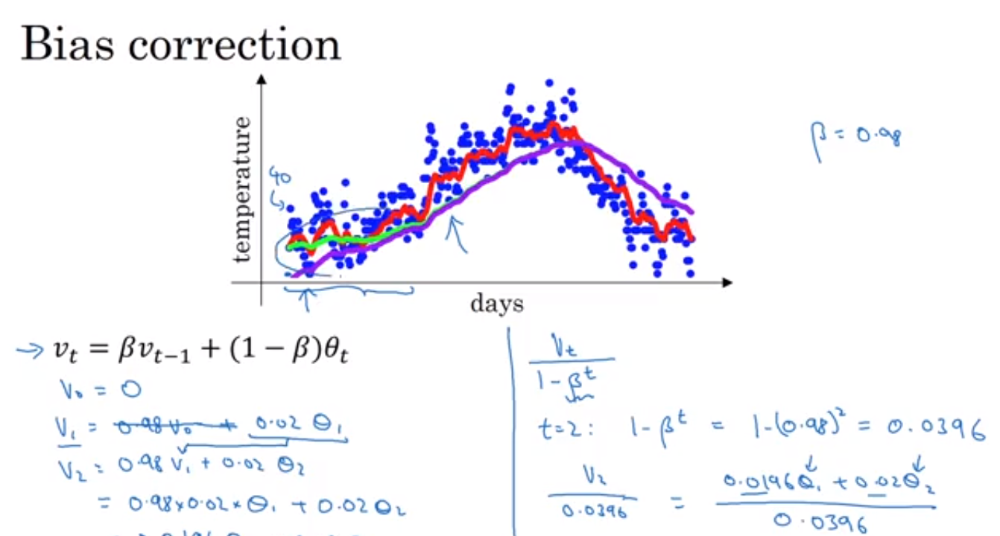

3. 动量算法

* 动量算法旨在加速学习，特别是处理高曲率。
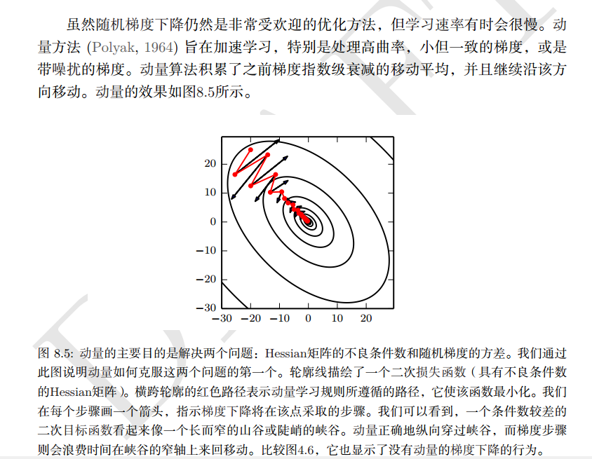
* 带动量的SGD算法
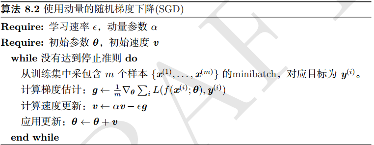
* 伪代码描述


#### 3.3 Nesterov 动量

* 计算公式
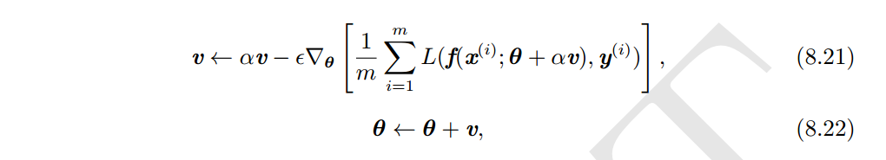
* 算法


### 4. 参数初始化   how

* 下面初始化为 he 初始化， 很有效
```
parameters['W' + str(l)] = np.random.randn(layers_dims[l], layers_dims[l - 1]) * np.sqrt(2 / layers_dims[l - 1])
parameters['b' + str(l)] = np.zeros((layers_dims[l], 1))
```
* [示例](02.正则化，优化/Initialization.html)
* 初始化要在不同单元之间破坏对称性。


### 5. 具有自适应学习率的算法   how

#### 5.1 AdaGrad

#### 5.2 RMSProp （均方根传递）Root Mean Square Prop

* 

#### 5.3 Adam

* 将动量算法和RMSProp算法结合起来
* 

#### 5.4 选择正确的学习算法


### 6. 二阶近似方法   

#### 6.1 牛顿法

#### 6.2 共轭梯度

### 6.3 BFGS

### 7 优化策略和元算法

#### 7.1 batch normalization

* 中心化
    * 计算均值
    * 减去均值
* 归一化
    * 计算方差：  δ**2 = 1/m * Σ(x{i} ** 2)
    * 减去方差： x / δ**2
* 这样你的数据分布更趋向于圆， 如果一直按着法线反向，能够更快得到最优结果。

* 批正则化处理， 这里使用两个参数是因为，如果你的激活函数是sigmoid，那么你希望你的值不要集中在中间，这样不利于使用
sigmoid的非线性特性。放置参数后，可以让你的模型有可控的均值和方差。


* 层的正则化可以确保当它们的值变化的时候均值和方差不变，这样可以确保这些层的输出具有一个良好的协方差。   它让网路独立于
其他层进行学习。
* 不要把它看做正则化，而是一种加速网络训练的方法。
* 批正则化在测试阶段的处理
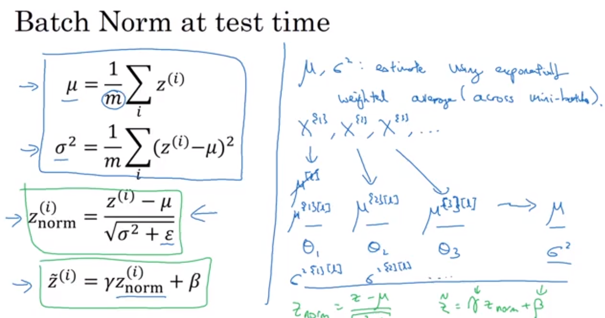


#### 7.2 坐标下降

#### 7.3 poly平均

#### 7.4 监督预训练

#### 7.5 涉及有助于优化的模型

#### 7.6 连续方法和课程学习

### 额外主题； Gradient checking


*[code](02.正则化，优化/Gradient_Checking.html)


### 额外主题： 学习率衰减


### 额外主题：softmax

* 输入和输出都是向量，只是输出进行了归一化处理
* softmax的损失函数自然是交叉熵


## 杂谈

### Yoshua Bengio

* 你要设法自己实现这些功能, 尽管可能效率不高 但是仅仅是为了确保你真正理解背后的东西 这点非常有用 自己多尝试
* 也就是说不要只用那些编程框架, 让你可以用几行代码 就完成所有功能, 但你实际不知道底层原理.
* 我想说我们应该更进一步 如果可以的话, 设法自己从基本原理中推出这些东西 这真的很有帮助 但是通常情况下 你必须阅读
 看其他人的代码 写自己的代码 做很多试验, 确保你理解你做的所有事情 特别对于科学来说 这是其中的一部分 
* 问问自己为什么我要做这些, 为什么其他人在做这些 可能答案就在书本的某一页, 你必须读更多的书  
如果你实际上能自己想出来, 那就更好  对 这样很酷
* 不过ICLRI大会汇刊 收集的好论文可能最多 当然NIPS和ICML 还有其他的会议, 也有很好的论文 但是如果你真的想接触很多好论文,
只要阅读最近几期的 ICLR汇刊, 这能让你真正地看清这个领域
* 这取决于你从哪儿开始 不要害怕数学 只要发展直觉， 然后只要你从直觉上把握了 事物背后的原理 数学就会变得相当容易
* 还有个好消息是你不需要5年的博士学习 来成为深度学习的高手 实际上如果你有很好的计算机科学和数学基础 只要学习短短几个月
 你就可以用好它 构建出东西 并且开始做研究试验 如果接受过良好的训练 大概只要六个月 可能他们一点都不了解 机器学习 
* 但是 如果他们擅长数学和计算机科学 这个过程会很快 当然 这意味着在数学和计算机科学方面 你需要有良好的训练 有时候
 你在计算机科学课程中学到的还不够 特别是 需要补充一些数学 比如概率论 代数和优化。 


### jiye

* 要对你所学习的东西有一个清晰的认识，这样才能学好。
* 正则化和优化说的是如何更好的拟合你的数据
    * 正则化：如何更好拟合训练集和测试集
    * 优化：如何更好拟合训练集，降低误差

