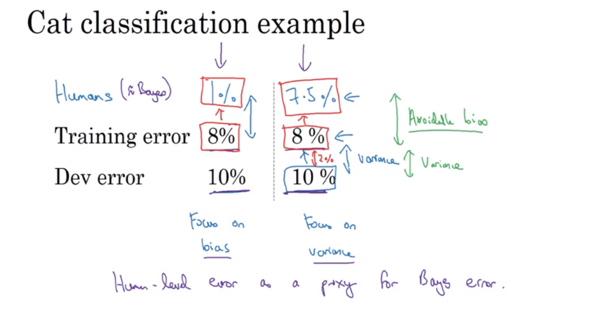
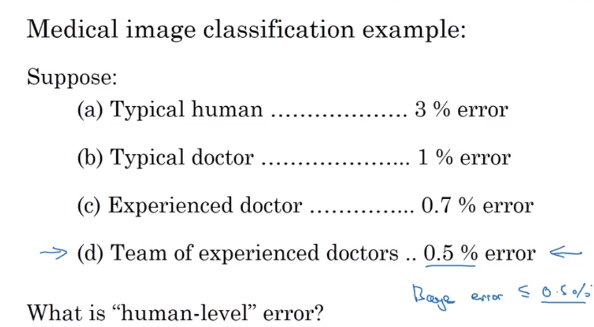
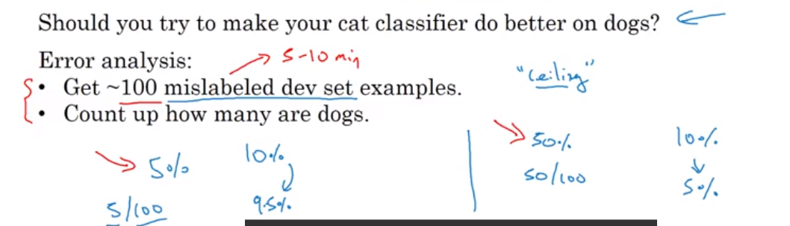

* idea
* code
* experiment

---

## train/ dev / test

* 验证集的目的是为了帮你快速评估算法，以便你可以判断算法A或B谁更好。
如果被错误标注的验证集的一小部分妨碍你做出这些判断的能力，那么花时间去修正错误标注的验证集标签是值得的。

* overfit：
    * 你的数据要同分布， 寻找更多的训练集
    * 但是如果训练集和测试集来自不同的分布，那么你的选择是不清晰的。几方面可能会出错：
        1. 在开发集上过拟合。
        2. 测试集比开发集更难。所以你的算法可能做的和预期一样好，因此没有进一步的重大改进的可能了。
        3. 测试集不一定更难，但只是和开发集不同。所以在开发集上表现很好但并不能在测试集上表现一样。
        这种情况下，之前很多提高开发集性能的努力可能都白费了
* 使用单一数字的指标来评估你的算法，比如准确率。
    * 如果使用查全率和查准率那么可以使用F1 score这个单一指标度量，这是一种基于其平均值改善的方法，比简单地取平均值效果要好
    
    * 当你面在大量的分类器中进行选择时，使用单一数字的评估指标可以加快你做出决策的能力。
    所有这些都给出了明确的表现排名，从而给出一个清晰的前进方向。
* 机器学习是一个高度迭代的过程：在发现你满意的方法之前你可能需要尝试很多的idea。

### 训练集合测试集分布不匹配

* 关注你的分布和目标，当你的主要目标是测试集上模型表现良好的时候，数据的分配要使得你的而开发集和验证集具有相同的分布
* 

---

## 误差分析

### 偏差和方差

* 理想误差: 人识别的误差，
* bias： 训练集上的训练误差
    * 尝试更大的模型
    * 使用更好的优化算法
    * 使用NN或者超参数调节 （RNN CNN） 
* variance： 测试集上的训练误差
    * 更多的数据
    * 正则化

### 与人类水平相比

* 可避免偏差：你的训练集误差和人类水平的差距

* 贝叶斯误差低于人类所能达到的最高水平

### 错误分类的样本

1. 取出分类错误的图片，然后看错误分类的东西中，有多少是该类，就知道你改进的空间了

2. 分析错误标签样本，看看有多少错误分类本来就是样本标记有问题。
3. 总结

---

## 超参数调节

### 1. 基本

* 当你的学习算法准确率不够高的时候，需要做什么
    * 学习率？
    * 收集更多的数据？
    * 优化算法？
    * 。。。
* 正交法调参
    * 一次调节一个参数
*  使用单一指标评估你的模型
    * idea
    * code
    * 实验
    * 使用单一指标评估你的模型
        * 比如平均值
        * 比如F1 score  
* 保持你的训练集测试集来自相同的分布
    * 你不能指望用一个目标训练好的模型，去测试另一个目标。
* Optimizing and satisficing metrics
    * satisficing metrics: 你能接受的时间阈值是多少
    * Optimizing： 在这个阈值下准确率越高越好    
    
#### 学习率调节

* 学习率突然变大，调节起来并不太好，学习率还是应该缓慢变化，并且变小。而不是一定概率变大变小。
* 线性变小你的错误率也是不合理的，因为前面需要变化快点，后面需要变化慢点。

### 网络层数变宽

* 网络变宽的时候学习率所有提升，或者能更快收敛。

### 2. 设立你的目标

* 训练集和测试集还有你的应用数据应该来自相同的分布
* 当有些任务对某一类有特殊要求的时候，错分某一类的权值要相应变化。
* 整体的方针是 如果在你当前使用的指标和数据上 获得很好的性能 并不对应于做好你真正关心的事情
 那就需要修改你的指标 和/或你的开发集和测试集 让它们能更好地反应 你真正需要算法做好的事情 
 通过评估指标和开发集 你可以 更快地对算法A还是算法B更好做出决定 可以确实地提高你和你的团队进行迭代的速度 
所以我的建议是 即便你无法定义一个完美的评估指标和开发集 你也应该尽快将它们确定下来 以此来驱动你们团队的迭代速度
 如果之后发现选的不好 你有了更好的想法 你完全可以再进行修改 对于大对数团队 我不建议 在没有任何评估指标和开发集的情况下 
 进行长时间的开发 因为这实际上会 降低你们团队进行迭代和改善算法的效率 以上我们讲了什么时候需要修改你的评估指标 和/或开发集和测试集 
 我希望这些指导方针能够帮助你为你的整个团队 设立一个明确的目标 从而能更有效率地朝着改善性能的方向进行迭代 

### 3. Build your first system quickly, then iterate

* 当你开始一个新项目时，尤其是在一个你不是专家的领域，很难正确猜测出最有前景的方向。
* 所以，不要在开始试图设计和构建一个完美的系统。相反，应尽可能快（可能在短短几天内）的构建和训练一个基本系统。
然后使用错误分析去帮助你识别最有前景的方向，并从那迭代地改进你的算法。
* 通过手动检查约100个算法错误分类的开发集样本来执行错误分析，并计算主要的错误类别。用这些信息来确定优先修正哪种类型的错误。
* 考虑将开发集分为手动检查的 Eyeball 开发集和不手动检查的 Blackbox 开发集。
如果在 Eyeball 开发集上的性能比在 Blackbox 开发集上好很多，那么你已经过拟合 Eyeball 开发集，并且应该考虑为其获得更多的数据。
* Eyeball 开发集应该足够大，以便于算法有足够多的错分类样本供你分析。对很多应用来说，含有1000-10000个样本的 Blackbox 开发集已足够。
* 如果你的开发集不够大到可以按照这种方式进行拆分，那么就使用 Eyeball 开发集来用于手动错误分析、模型选择和调超参。

---

## 杂谈

### Andrej Karpathy

* 去感受真正有意思的事情
* 总细节自己实现做起，这样的性价比很高。
