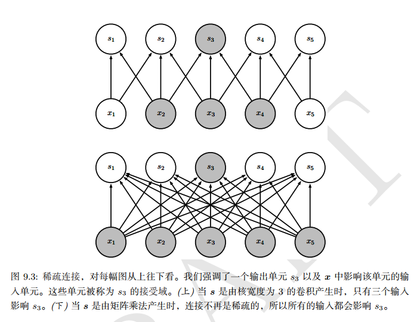
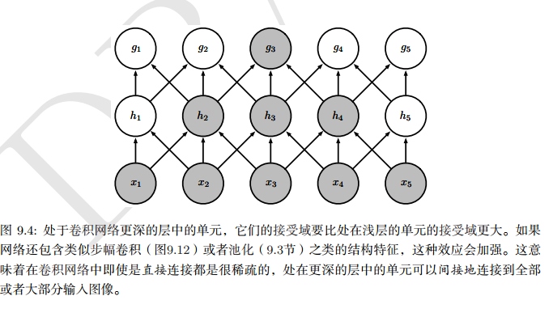
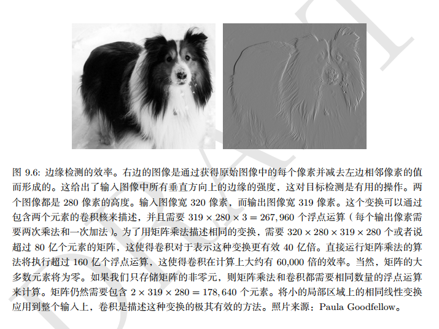
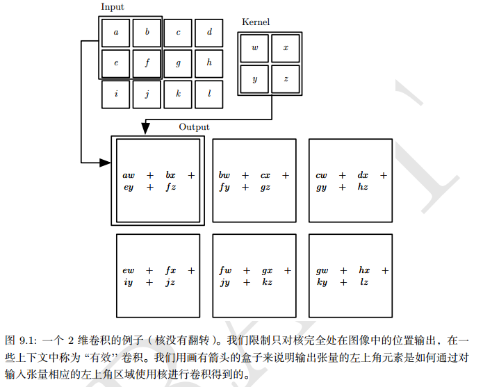

## 卷积 + 池化
* [《A guide to convolution arithmetic for deep learning》](paper/2018-A%20guide%20to%20convolution%20arithmetic%20for%20deep%20learning%20.pdf)


### what

* 像素值大的地方响应大
* [几篇类似于综述文章-3](https://adeshpande3.github.io/The-9-Deep-Learning-Papers-You-Need-To-Know-About.html)
* [Understanding and coding Neural Networks From Scratch in Python and R](https://www.analyticsvidhya.com/blog/2017/05/neural-network-from-scratch-in-python-and-r/)
* [从入门到精通：卷积神经网络初学者指南（附论文）](https://mp.weixin.qq.com/s?__biz=MzA3MzI4MjgzMw==&mid=2650717691&idx=2&sn=3f0b66aa9706aae1a30b01309aa0214c&scene=21#wechat_redirect)
* [卷积神经网络简介](https://zhuanlan.zhihu.com/p/25249694)
* [一文概览深度学习中的卷积结构](https://mp.weixin.qq.com/s?__biz=MzA3MzI4MjgzMw==&mid=2650731362&idx=4&sn=d163dd19d806f84928cacae8e92f5114&chksm=871b371cb06cbe0a738122035ff03c67eb4be20730722fd8a6f36e8b116b5501e1124bff02fe&scene=21#wechat_redirect)
* 卷积网络的三个重要思想：
    * 稀疏交互
    * 参数共享
    * 等变表示
* 通过稀疏交互
    * 核变小
    * 层与层之间，同一个输入影响的输出变少了
* 池化不补边，计算公式和卷积相同。
* [卷积神经网络CNN（1）——图像卷积与反卷积（后卷积，转置卷积）](https://blog.csdn.net/fate_fjh/article/details/52882134)
    





    
* 参数共享
    * 层与层之间，影响同一个输出的的输入变少了
    * 更深的网络，更大的感受野
        * 更深的网络的同一个输入，受更多最原始输入的影响     
* 等变表示
    * 输入改变，输出同样的方式改变
    
   
    
### why

#### 特征（模式，激活的神经元，特征检测）

* 当当前输入的感受野中有特别的模式的时候， 神经元被激活
* 神经元检测模式可以通过（1）（2）（3）可视化：
    * 优化它的输入区域最大化神经元激活
    * 可视化梯度或者在输入像素上（bp）指导梯度的神经元
    * 在训练集上可视化一组激活神经元最大的图片区域，

### how

* 计算机调整过滤器值在训练期间，是通过反向传播。

### which










### 激活函数

#### 有哪些

* sigmoid function [0, 1]: a = 1 / (1 + e ^ -z)
* tanh function [-1, 1]
* ReLU: 解决梯度消失问题，但是还是有问题，
* Leak ReLU

#### why 激活函数

* 非线性组合



* [变形卷积核、可分离卷积？卷积神经网络中十大拍案叫绝的操作](https://zhuanlan.zhihu.com/p/28749411)
* [CNN中千奇百怪的卷积方式大汇总](https://zhuanlan.zhihu.com/p/29367273)







## 杂谈

### 如何学习：
* Start with simple basics and develop an intuition on the subject.
*  pick a problem and start solving it
* Learn the concepts while you are solving the problem. Keep tweaking and improving your understanding. 
* you read up how to apply an algorithm – go out and apply it. 
* Once you know how to apply it, try it around with different parameters, values, limits and develop an understanding of the algorithm.

  