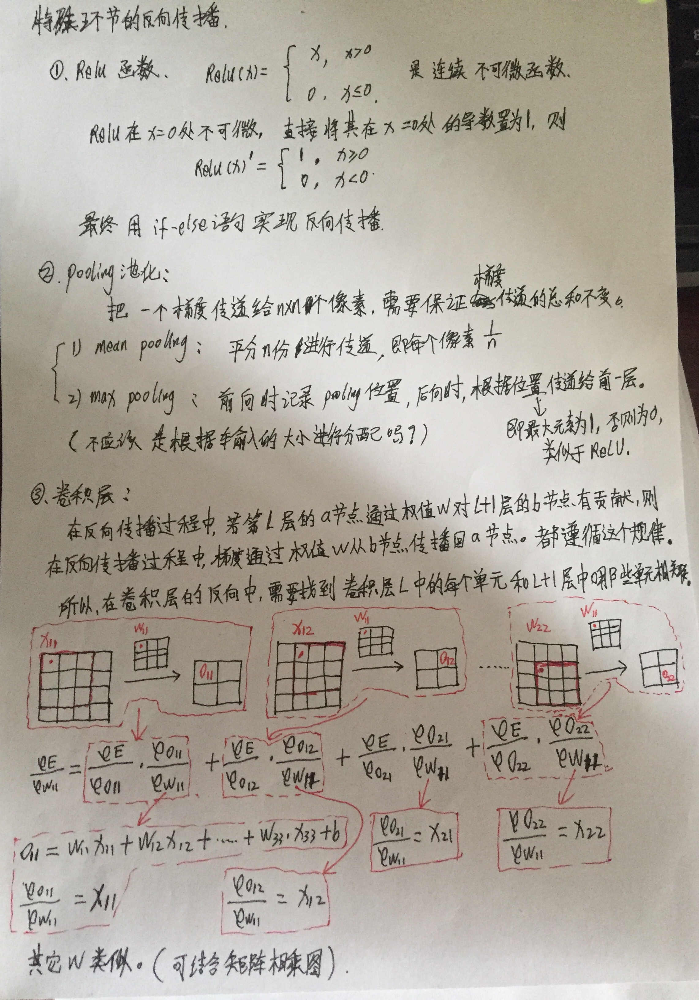

## 反向传播

* [反向传播算法推导-卷积神经网络](https://mp.weixin.qq.com/s/DGKscPcu3fobUQUfi1u4tQ)
    

### 《2016-Relay Backpropagation for Effective Learning of Deep Convolutional Neural Networks》
* [paper](paper/2016-Relay%20Backpropagation%20for%20Effective%20Learning%20of%20Deep%20Convolutional%20Neural%20Networks.pdf)

* [如何直观地解释 back propagation 算法？](https://www.zhihu.com/question/27239198?rf=24827633)
* [Backpropagation In Convolutional Neural Networks](http://jefkine.com/general/2016/09/05/backpropagation-in-convolutional-neural-networks/)
* [http://cs231n.github.io/optimization-2/](http://cs231n.github.io/optimization-2/)

## 梯度弥散和梯度爆炸

* 0.9^30 = 0.04

* [梯度弥散与梯度爆炸](https://www.cnblogs.com/yangmang/p/7477802.html)
    * 如果 `z=wa2 + b2`，则导数为 `dz = w da`,这里如果w>1，那么就会层数过多而爆炸，如果w<1那么，层数多了就会弥散，
    出现不学习的情况，更新很慢，需要更大的学习率。

* [Why are deep neural networks hard to train?](http://neuralnetworksanddeeplearning.com/chap5.html#the_vanishing_gradient_problem)
    * 