## optimization

### 写在前面

* [Adam那么棒，为什么还对SGD念念不忘 (1) —— 一个框架看懂优化算法](https://zhuanlan.zhihu.com/p/32230623)
* [Adam那么棒，为什么还对SGD念念不忘 (3)—— 优化算法的选择与使用策略](https://zhuanlan.zhihu.com/p/32338983)
    * [自己总结请看](14.一个框架看懂优化算法.docx)
    
* [Adam那么棒，为什么还对SGD念念不忘 (2)—— Adam的两宗罪](https://zhuanlan.zhihu.com/p/32262540)
    * 大家都是殊途同归，只是相当于在SGD基础上增加了各类学习率的主动控制。如果不想做精细的调优，那么Adam显然最便于直接拿来上手。
    * Adam罪状一：可能不收敛
        * SGD学习率恒定
        * AdaGrad二阶动量不断积累，单调递增，学习率单调递减，最后收敛到0，模型也得以收敛
        * AdaDelta和Adam则不然，二阶动量固定时间窗口内的累积，随着时间窗口的变化，遇到的数据可能发生巨变，
        使得二阶动量可能时大时小，不是单调变化，这可能在训练后期引起学习率震荡，导致模型无法收敛；
    * Adam罪状二：可能错过全局最优解
        * Adam的收敛速度比SGD要快，但最终收敛的结果并没有SGD好。他们进一步实验发现，主要是后期Adam的学习率太低，影响了有效的收敛。
    * 到底该用Adam还是SGD？三点小提醒
        1. 前期用Adam，享受Adam快速收敛的优势；后期切换到SGD，慢慢寻找最优解。
        2. 但这提醒了我们，理解数据对于设计算法的必要性。优化算法的演变历史，都是基于对数据的某种假设而进行的优化，
        那么某种算法是否有效，就要看你的数据是否符合该算法的胃口了。

* [为什么梯度反方向是函数值局部下降最快的方向？](https://zhuanlan.zhihu.com/p/24913912)
    * 导数代表了在自变量变化趋于无穷小的时候，函数值的变化与自变量变化的比值，几何意义有该点的切线。物理意义有该时刻的（瞬时）变化率；
    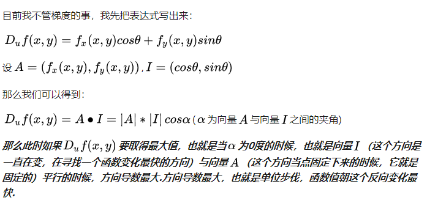

* [梯度下降法是万能的模型训练算法吗？](https://www.zhihu.com/question/38677354)
    * 不是。优化的原理可以这么理解：利用关于最优解的信息，不断逼近最优解。
    * 梯度下降（或上升）方法有效的前提条件是，梯度方向指向最优解方向，
    
    

> what + how + why

> 下面回答 what
---
* 寻找神经网络中的一组参数，它能显著降低代价函数，该代价函数包含整个训练集的评估和额外的正则项。

* 梯度下降是一种优化技术，决定参数需要优化的值，来增加模型的表现最小化损失函数。
* 找到目标函数的最优解

### 基于梯度的优化

* 导数内涵：提供当目标函数需要变化时，应该往哪个方向

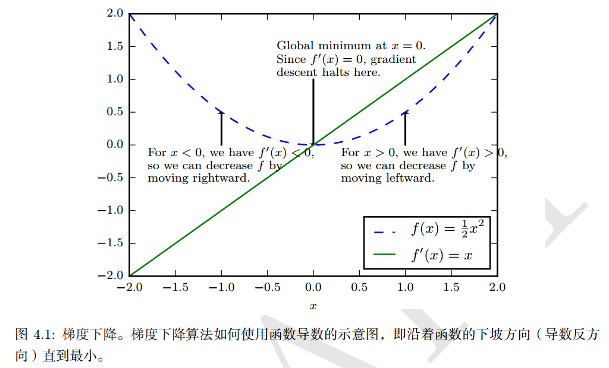

#### 1. 梯度之上： Jacobian和Hessian矩阵

* 我们遇到的Hessian矩阵几乎都是对称的，因为Hessian矩阵是实对称的，我们可以将其分解成一组实特征值和特征向量的正交。


> 下面算法都是why的问题
----

### 批算法和minibatch算法


* 在数据集上的一次迭代叫做一个epoch， 在每个minibatch上迭代一次，叫做一步。
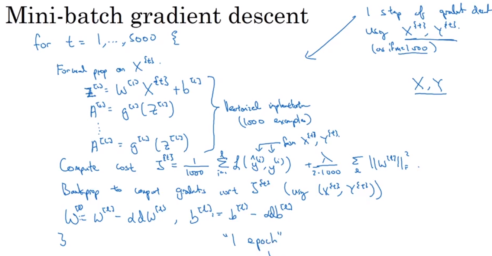
* 每一批选择n的大小不能太大


### 2. 神经网络优化中的挑战    

#### 2.1 病态


#### 2.2 局部极小值

* 凸优化问题的一个典型特点是其可规约成一个寻找局部极小值问题。
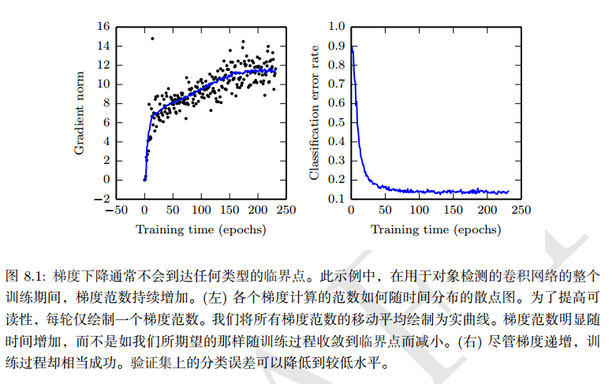
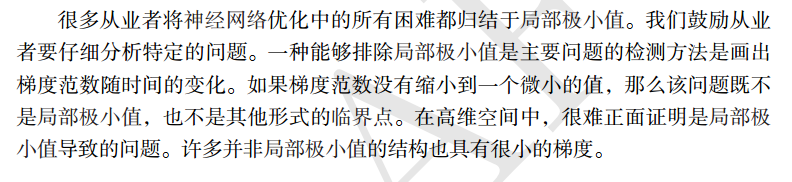
* 学者们现在猜想，对于足够大的神经网络来说，大部分局部极小值都具有很小的代价函数，我们能不能找到全局最小值，变得不是那么
重要了。

#### 2.3 鞍点和其他平坦区域

* 多数随机函数表现出，低维中局部极小值很常见，鞍点不常见，高维中，局部极小值很少见，但鞍点常见。

#### 2.4 梯度消失和爆炸


#### 2.5 长期依赖

* 因为长期依赖导致的梯度连乘中变得过大或者过小
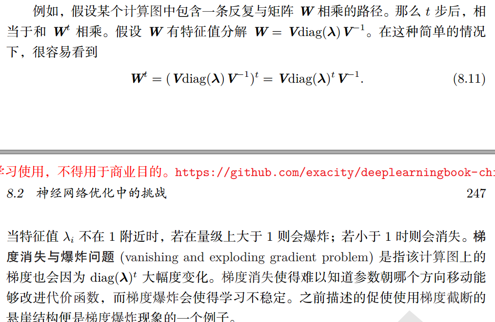
* 这里的问题主要出现在循环神经网络中。

#### 2.6 非精确梯度

#### 2.7 局部和全局结构间的弱对应

* 当初始值初始不好时，优化只能趋向于一个局部小值，因为梯度下降只是让函数值变小。


#### 2.8 优化的理论限制

* 有些问题只能是一个优化过程，不能定义是不是可解


> 下面算法都是how的问题
---
### 3. 基本算法           

#### 随机梯度下降

* 每次随机变换一个步伐
* 梯度指示方向信息，学习率指示改变的步长，更新的是参数，目的是当输入一定的时候，损失函数变小。
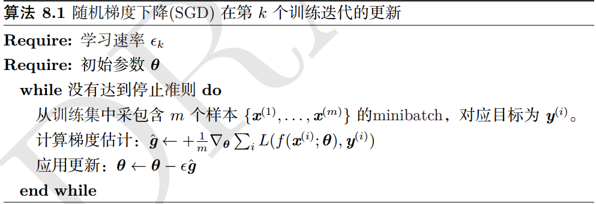

#### 3.2 动量

1. exponential weight average
    * 权值平均技术
    * v{t} = β*（v{t - 1}） + (1 - β)x
    * x表示实际每天的值，v{t}表示一个每天值的近似，这样处理之后每天的值就是一条曲线。
    * 当β很大时，收到前面值的影响也比较大，比如，前面50天的都有影响，直线越平滑
    * 当β很小时，表示受到前面的值影响越小，也就是越趋向于实时值，曲线抖动越明显。

* 指数平滑具体计算方法：对应值和对应参数乘，就得到了v100,这里的受前面天影响情况，按指数衰减
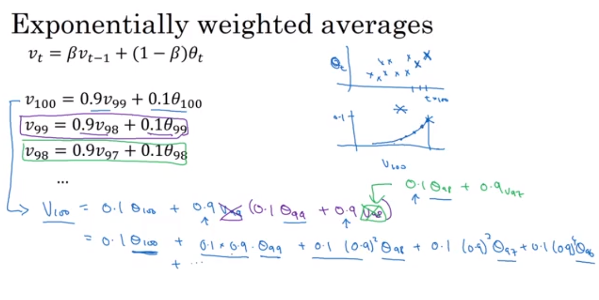

2. 偏差修正
* 指数平均中，开始的时候起点太低了，为了平均开始的这些值，使用偏差修正，也就是在每个v{t} / (1-β^{t})
* 开始的时候分母小，然后偏差修正，后面的时候分母为1，不影响。


3. 动量算法

* 动量算法旨在加速学习，特别是处理高曲率。

* 带动量的SGD算法

* 伪代码描述
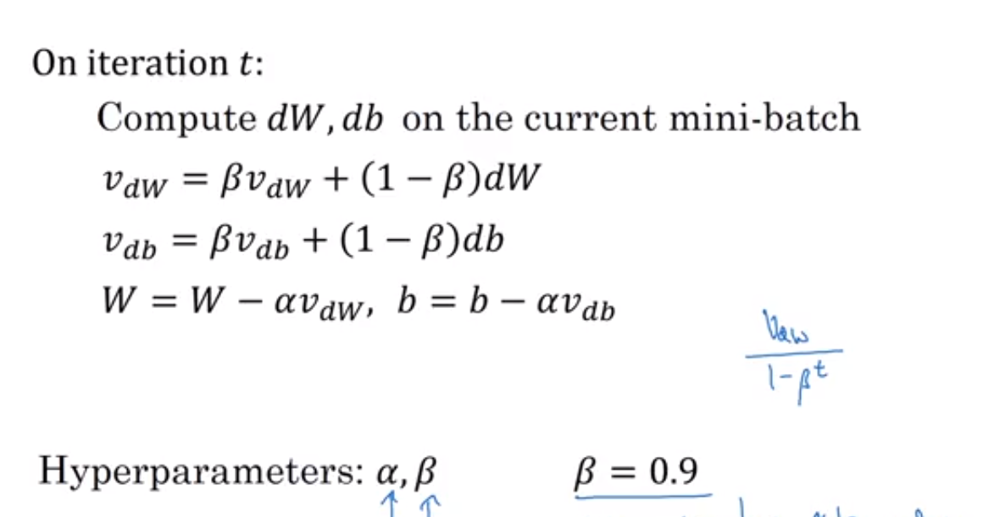


#### 3.3 Nesterov 动量

* 计算公式

* 算法
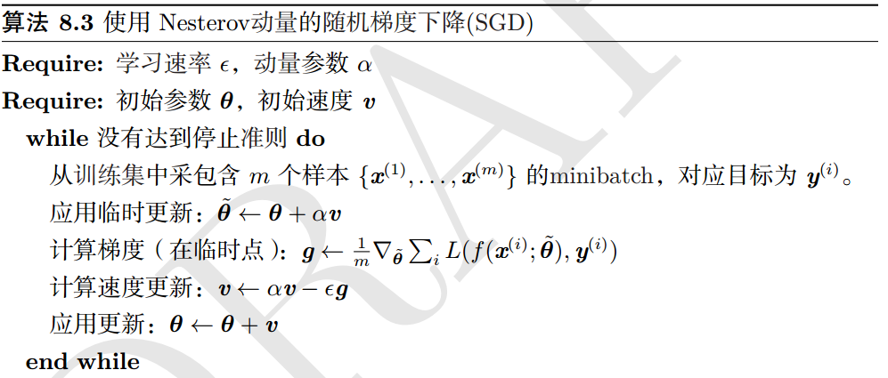

### 4. 参数初始化   how

* 下面初始化为 he 初始化， 很有效
```
parameters['W' + str(l)] = np.random.randn(layers_dims[l], layers_dims[l - 1]) * np.sqrt(2 / layers_dims[l - 1])
parameters['b' + str(l)] = np.zeros((layers_dims[l], 1))
```
* [示例](readme/Initialization.html)
* 初始化要在不同单元之间破坏对称性。


### 5. 具有自适应学习率的算法   how

#### 5.1 AdaGrad

#### 5.2 RMSProp （均方根传递）Root Mean Square Prop

* 

#### 5.3 Adam

* 将动量算法和RMSProp算法结合起来
* 

#### 5.4 选择正确的学习算法


### 6. 二阶近似方法   

#### 6.1 牛顿法

#### 6.2 共轭梯度

### 6.3 BFGS

### 7 优化策略和元算法

#### 7.1 batch normalization

* 中心化
    * 计算均值
    * 减去均值
* 归一化
    * 计算方差：  δ**2 = 1/m * Σ(x{i} ** 2)
    * 减去方差： x / δ**2
* 这样你的数据分布更趋向于圆， 如果一直按着法线反向，能够更快得到最优结果。

* 批正则化处理， 这里使用两个参数是因为，如果你的激活函数是sigmoid，那么你希望你的值不要集中在中间，这样不利于使用
sigmoid的非线性特性。放置参数后，可以让你的模型有可控的均值和方差。
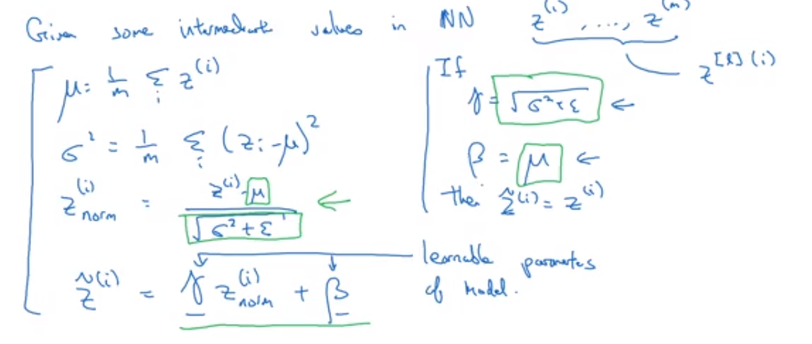

* 层的正则化可以确保当它们的值变化的时候均值和方差不变，这样可以确保这些层的输出具有一个良好的协方差。   它让网路独立于
其他层进行学习。
* 不要把它看做正则化，而是一种加速网络训练的方法。
* 批正则化在测试阶段的处理


#### 7.2 坐标下降

#### 7.3 poly平均

#### 7.4 监督预训练

#### 7.5 涉及有助于优化的模型

#### 7.6 连续方法和课程学习

### 额外主题； Gradient checking

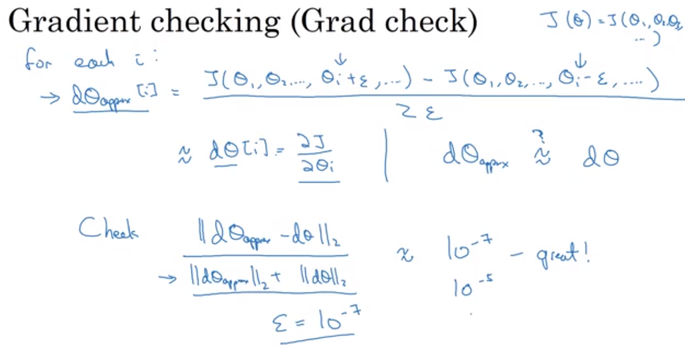


* [code](readme/Gradient_Checking.html)


## 论文阅读

### 《Regularization and Optimization strategies in Deep Convolutional Neural Network》
* [paper](paper/2017-Regularization%20and%20Optimization%20strategies%20in%20Deep%20Convolutional%20Neural%20Network.pdf)
* [概览深度学习中的五大正则化方法和七大优化策略](https://zhuanlan.zhihu.com/p/32194445)
    * 有些算法同时更新学习率，Adagrad
    * 有些算法同时更新动量：Momentum，Nesterov 加速梯度
    * 有些算法同时更新学习率，动量：AdaDelta，
    