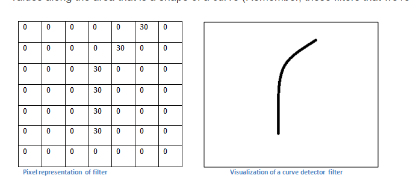

* [A Beginner's Guide To Understanding Convolutional Neural Networks Part-3](https://adeshpande3.github.io/The-9-Deep-Learning-Papers-You-Need-To-Know-About.html)
    * 如果局部出现边缘特征，则该输出响应大 \
    
    * 因此反向传播可以分为4部分
        1. 前馈过程
        2. 损失函数
        3. 反向过程
        4. 权值更新