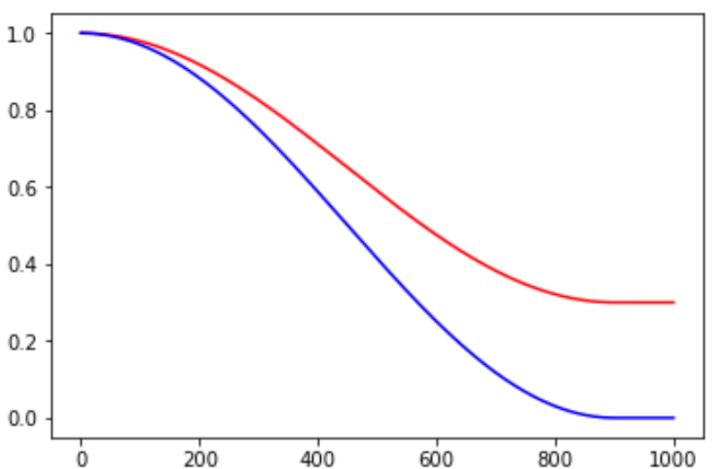
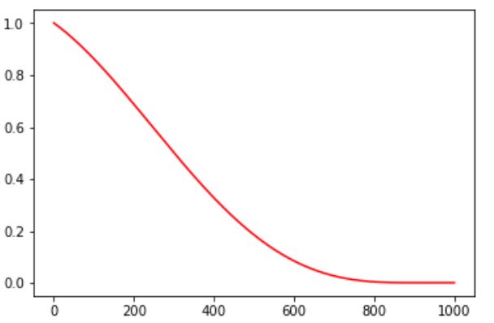

* [Tensorflow中learning rate decay的奇技淫巧](https://zhuanlan.zhihu.com/p/32923584)
    * exponential_decay \
    
    * piecewise_constant:分段常数下降法类似于exponential_decay中的阶梯式下降法，不过各阶段的值是自己设定的。\
    
    * polynomial_decay: polynomial_decay是以多项式的方式衰减学习率的。
    ```
    global_step = min(global_step, decay_steps)
    decayed_learning_rate = (learning_rate - end_learning_rate)*(1-global_step / decay_steps)^(power)+ end_learning_rate
    ```
    
    * natural_exp_decay: natural_exp_decay和exponential_decay形式差不多，只不过自然指数下降的底数是 1/e 型。\
    
    * inverse_time_decay:
    ```
    decayed_learning_rate = learning_rate / (1 + decay_rate * global_step / decay_step)
    ```
    
    * cosine_decay: alpha的作用可以看作是baseline，保证lr不会低于某个值。
    ```
    global_step = min(global_step, decay_steps)
    cosine_decay = 0.5 * (1 + cos(pi * global_step / decay_steps))
    decayed = (1 - alpha) * cosine_decay + alpha
    decayed_learning_rate = learning_rate * decayed
    ```
    
    * cosine_decay_restarts:cosine_decay的cycle版本。first_decay_steps是指第一次完全下降的step数，
    t_mul是指每一次循环的步数都将乘以t_mul倍，m_mul指每一次循环重新开始时的初始lr是上一次循环初始值的m_mul倍。
    
    * linear_cosine_decay: 主要应用领域是增强学习领域，本人未尝试过。可以看出，该方法也是基于余弦函数的衰减策略。
    
    * noisy_linear_cosine_decay: 
    * auto_learning_rate_decay:

    
    


## 论文

### 《SGDR: Stochastic Gradient Descent with Warm Restarts》
* [paper](paper/2017-SGDR-%20Stochastic%20Gradient%20Descent%20with%20Warm%20Restarts.pdf)
* cosine_decay: alpha的作用可以看作是baseline，保证lr不会低于某个值。
```
global_step = min(global_step, decay_steps)
cosine_decay = 0.5 * (1 + cos(pi * global_step / decay_steps))
decayed = (1 - alpha) * cosine_decay + alpha
decayed_learning_rate = learning_rate * decayed
```


### Neural Optimizer Search with Reinforcement Learning
* [paper](paper/2017-Neural%20Optimizer%20Search%20with%20Reinforcement%20Learning.pdf)
* linear_cosine_decay


