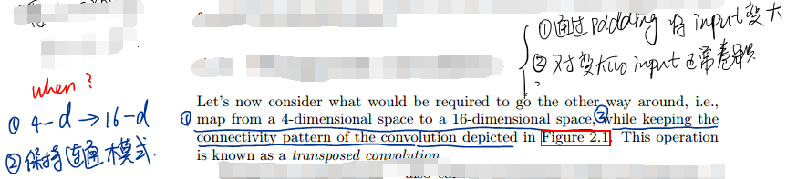
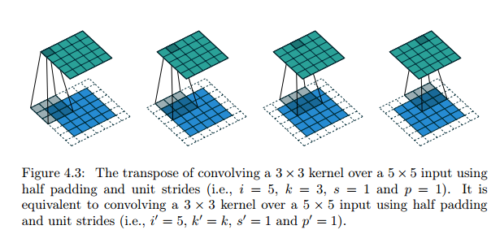
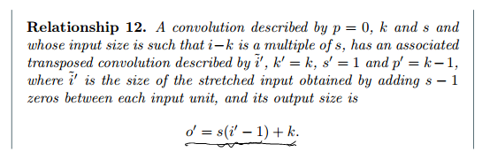

* [paper](paper/23.901-18-A-guide-to-convolution-arithmetic-for-deep-learning.pdf)

## what 

1. Explain the relationship between convolutional layers and transposed convolutional layers.   
2. Provide an intuitive understanding of the relationship between input shape, kernel shape, zero padding, strides and output shape in convolutional, pooling and transposed convolutional layers.   

## where

### 1. 离散卷积

#### 1.1 they share these important properties   

* They are stored as multi-dimensional arrays. 
* They feature one or more axes for which ordering matters (e.g., width and height axes for an image, time axis for a sound clip). 
* One axis, called the channel axis, is used to access different views of the data (e.g., the red, green and blue channels of a color image, or the left and right channels of a stereo audio track).   

#### 1.2 输入输出关系

* padding下： *o* = (*i* *−* *k*) / 2 + 2*p* + 1 
* full padding下：输出多少可以根据上式计算padding  

### 2. 反卷积

####  2.1 方式一：边缘padding

* 输出大小

#### 2.2 方式二：内部padding、

* 输出大小

